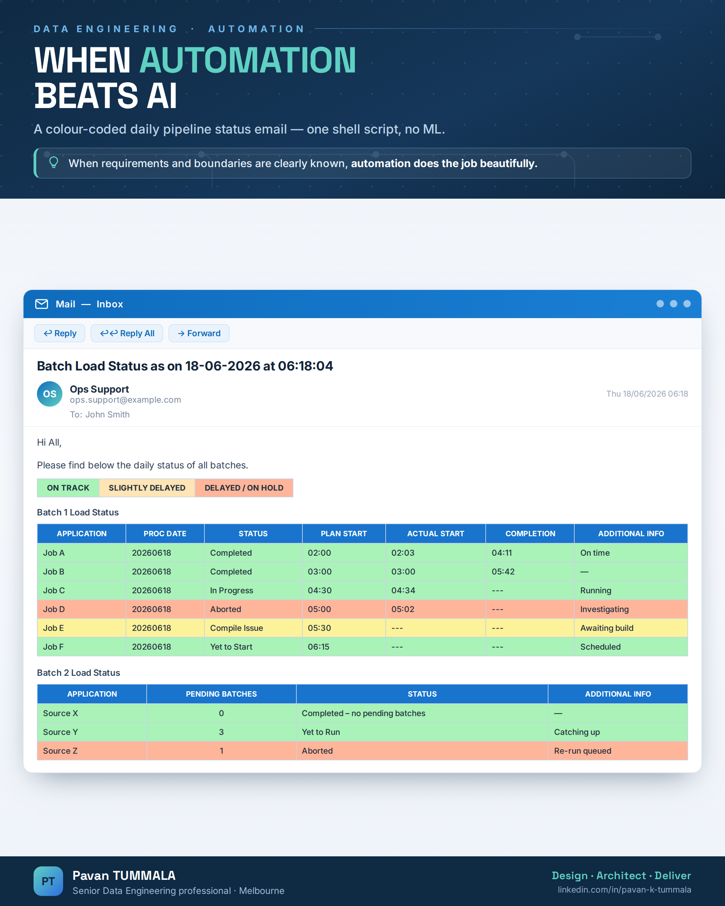
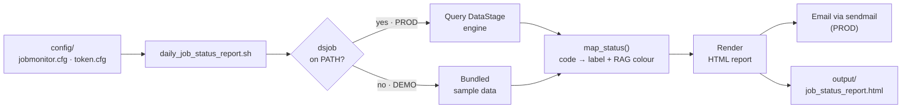

# Daily Job Status Automation

A pure-shell tool that reads a catalogue of **DataStage** master sequences, queries
each one for its run metadata and status, **RAG colour-codes** the result, and sends
a daily HTML status email — so the on-call team can read the health of the entire
batch at a glance, straight from their inbox.

No AI, no ML, no extra infrastructure. When the requirements and boundaries of a
problem are clearly known, automation does the job beautifully.

## What the output looks like



Green = on track, amber = slightly delayed, salmon = delayed / on hold, yellow =
needs attention. The colour tells you the story before you read a single word.

## How it works



Each job is queried once, its status is mapped to a label and a RAG colour in one
place, and the rows are rendered into the HTML report — emailed in production, or
written to a file in demo mode.

## Data engineering patterns used

- **Config / metadata driven** — the job catalogue, source paths, server and
  recipients all live in config. The script carries no hard-coded environment detail,
  so the same code runs across dev, test and prod.
- **Single-query efficiency** — each job is reported **once** and its start, end and
  elapsed times are parsed from that single result, instead of shelling out to the
  engine repeatedly.
- **Single source of truth** — one `map_status` function translates every DataStage
  status code into a label *and* a RAG colour, so the legend and every table stay
  consistent and the rules live in exactly one place.
- **Read-only + idempotent** — the report only observes; running it twice never
  changes state, which makes it safe to re-run or schedule freely.
- **RAG observability** — status is encoded as colour, turning a wall of text into a
  signal a human can scan in two seconds.
- **Generalisation over special-casing** — the original derived a processing date via
  ~20 hard-coded job names; here that collapses to two reusable patterns (from the
  source feed's landing file, or from the job's own start time).

## Quick start (demo mode)

No DataStage and no mail server required. If the `dsjob` CLI isn't found, the script
automatically runs in **demo mode** against the bundled sample config and writes the
HTML report to `output/job_status_report.html`.

```bash
cd daily_job_status_automation
./daily_job_status_report.sh
# -> Report written to: output/job_status_report.html  (mode: DEMO)
# open that file in any browser to see the colour-coded report
```

Run a single job, or force a mode:

```bash
ONLY_JOB=Job_C ./daily_job_status_report.sh     # just one sequence
DEMO=1 ./daily_job_status_report.sh             # force demo
```

## Configuration

**`config/jobmonitor.cfg`** — one row per master sequence (pipe-delimited):

```
# id|job|run_days|plan_start|plan_end|project|grp|service|info
1|Job_A|Mon Tue Wed Thu Fri|02:00|03:00|PROJ_DWH|G1|Customer Load|On time
```

**`config/token.cfg`** — catch-up / pending-batch jobs:

```
# job|project|token|info
Source_X|PROJ_DWH|TOK_X|
```

## Running in production

On a DataStage engine (where `dsjob` is on the PATH) the script switches to **prod
mode** automatically. Set the environment block at the top of the script — or export
the variables — and add `--send` to email the report:

```bash
DS_SERVER=":31539" \
ARCHIVE_ROOT="/var/datastage/DWHPROD/archive" \
MAIL_FROM="ops.support@yourcompany.com" \
MAIL_TO="john.smith@yourcompany.com" \
./daily_job_status_report.sh --send
```

Typical scheduling via cron (e.g. every morning at 06:30):

```cron
30 6 * * 1-5  /path/to/daily_job_status_report.sh --send
```

> Sample job names, source systems, paths and addresses in this repo are all
> generic placeholders. Point the config at your own environment to use it.

## Files

```
daily_job_status_automation/
├── daily_job_status_report.sh   # the tool (runnable in demo mode)
├── job-status-README.md         # this file
├── sample-email-output.png      # example of the rendered report
├── config/
│   ├── jobmonitor.cfg           # master-sequence catalogue
│   └── token.cfg                # catch-up / pending-batch catalogue
└── output/                      # generated reports (git-ignored)
```
