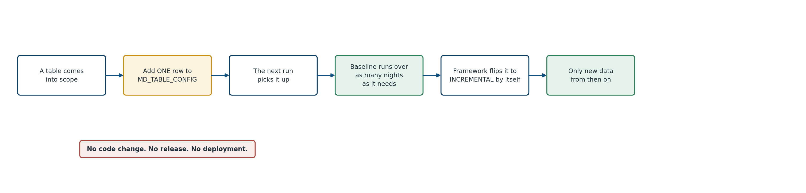
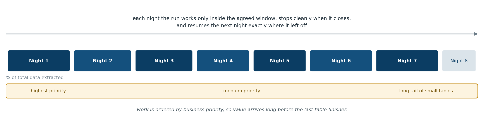
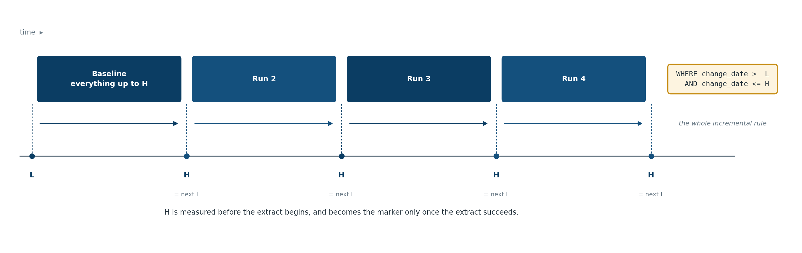
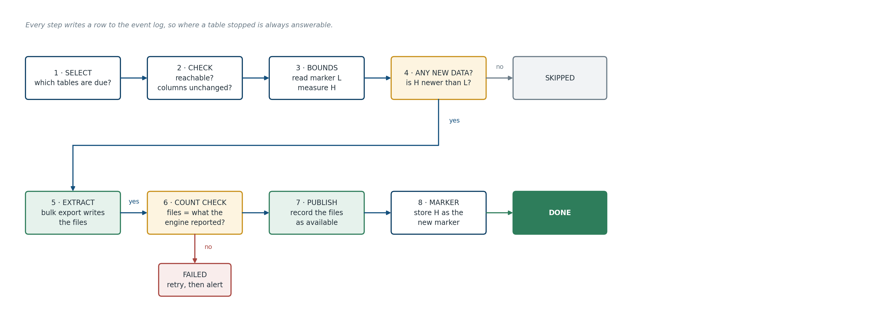
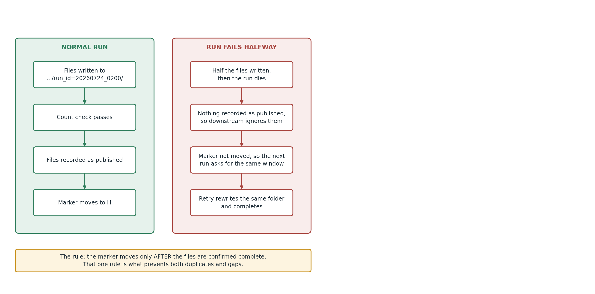
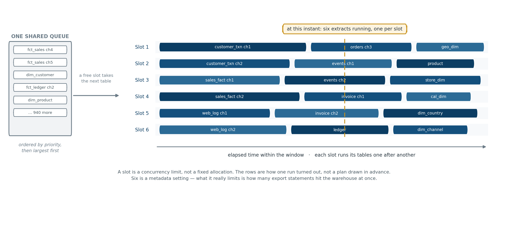
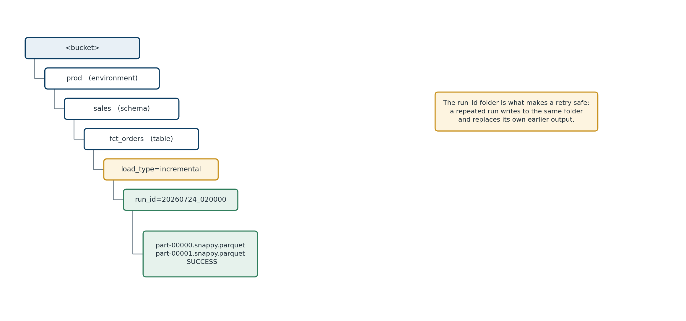
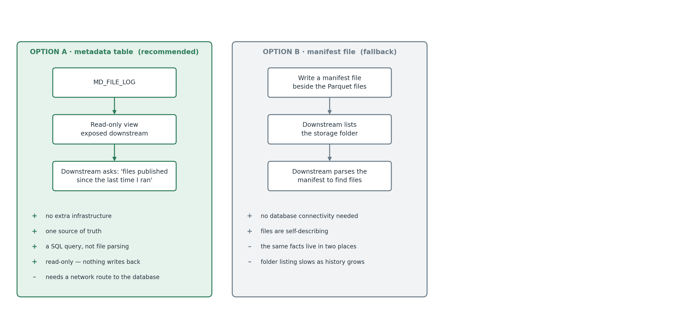

# Getting a Data Warehouse Out in Files

*A metadata-driven pattern for large-scale extraction and migration*

**Pavan Kumar Tummala**

White paper · Version 1.0

---

## 1. Why I wrote this

Sooner or later, most data warehouses have to be copied somewhere else. A platform migration, a cloud change, a merger, a new analytics stack, an archive obligation. The requirement usually arrives sounding trivial — *"we just need the data out"* — and it is anything but.

The pattern is always roughly the same shape. There is a source warehouse holding hundreds or thousands of tables. There is a target platform that will eventually hold the same data. And in between there is a decision about how the data crosses the gap. The most durable answer, and the one this paper describes, is to **write the data out as files into object storage** and let the target read those files.

That decision is the easy part. What follows is not:

- The first full copy will not finish in one night, and someone has to be told that early.
- Once it is finished, "only what has changed since last time" turns out to be a surprisingly subtle idea.
- A thousand tables cannot each have their own script, or the thing becomes unmaintainable within a quarter.
- Something will fail at 3 a.m., and what happens next determines whether the whole design was sound.

I have written this up because the same questions come round every time, the same mistakes are available to be made, and most of the material I have seen either stays at architecture-diagram altitude or dives straight into one vendor's syntax. This sits in between: a design you could build, described in terms general enough to apply to whichever warehouse and whichever target you happen to have.

I use **Amazon Redshift** as the source and **Microsoft Fabric** as the target throughout, because worked examples are more useful than abstractions. Almost none of the reasoning depends on that choice. Where something is genuinely platform-specific, I have said so and put the details in Appendix C.

**Who this is for:** data engineers and architects who have to build this, and the people who have to approve it. I have kept the language plain enough for the second group and the detail deep enough for the first.

**Two terms used throughout:**

- **Baseline load** — the first copy of a table, which copies all of it.
- **Incremental load** — every copy after that, which copies only what is new or changed.

---

## 2. The problem, stated properly

Take a warehouse of roughly a thousand tables and perhaps fifty terabytes. It is loaded overnight by existing processes. It serves reports during the day. It has to be copied, in full and then continuously, to a platform on the other side of a network boundary — often another cloud.

Underneath the apparent simplicity, five things make this hard:

**Volume against time.** Fifty terabytes does not move in a maintenance window. The arithmetic has to be done honestly and early, because the answer usually surprises people.

**Change detection.** After the first copy, you need to know what changed. Warehouses rarely make this easy, and the column you were told to trust often cannot be.

**Scale of configuration.** A thousand tables means a thousand sets of decisions. If those decisions live in code, the code becomes the bottleneck and every new table becomes a release.

**Failure is normal.** Over a run that spans weeks, things fail. The design has to make failure cheap and recovery automatic, because manual recovery does not scale to a thousand tables.

**Two teams, one boundary.** Whoever extracts and whoever loads are usually different people with different priorities. The contract between them needs to be explicit, or every incident becomes an argument.

Everything in this paper is a response to one of those five.

---

## 3. What this pattern covers

**In scope:**

- Building and maintaining the inventory of tables to be copied.
- A one-time baseline copy of each, followed by ongoing incremental copies.
- Writing output files into an agreed location in object storage.
- Verifying the copy worked, recording what was produced, raising alerts when it did not.
- A documented handover to whoever consumes the files.

**Out of scope, deliberately:**

- Loading the files into the target platform.
- Transformation, cleansing, and business rules. **This pattern extracts raw.**
- Modelling, reporting, or semantic layers.
- Re-platforming stored procedures, views, or existing pipelines.
- Decommissioning the source.

The scope ends the moment a file is written and recorded as available. That line matters more than it looks, and Section 15 is largely about defending it.

---

## 4. Six design decisions

These shape everything else. Each is stated with its reasoning and — more importantly — its consequence.

| # | Decision | Why | What it costs you |
|---|---|---|---|
| **D1** | **The baseline runs as a scheduled batch, night after night, until finished.** Restoring a temporary copy of the warehouse stays available as a fallback. | It uses infrastructure that already exists. No new clusters, no new access policies, no additional administration. | The baseline takes several nights rather than one. Progress must be tracked per table so that "how far along are we" always has an answer. See Sections 9 and 9.5. |
| **D2** | **Extract raw. No transformation.** | Transformation belongs in the target, where the model is being built. | The framework stays small. When a business rule changes, nobody re-extracts fifty terabytes — the target reprocesses files it already holds. The trade-off is that sensitive data lands unmasked unless policy says otherwise; see Section 18. |
| **D3** | **Do not track what kind of change occurred.** | We are copying data, not replaying transactions. | We never know whether a row was inserted or updated, and we do not need to. If its change-date is newer than our marker, we copy it. |
| **D4** | **Do not attempt to detect physically deleted rows.** Rows *flagged* as deleted are handled normally. | Detecting a physical deletion requires change tracking at source or repeatedly comparing full key lists. Both are disproportionate for a raw extract. | A row removed with a `DELETE` stays in our earlier files. This must be stated in the handover. Section 10.6 explains the distinction, which is more favourable than it first appears. |
| **D5** | **All logic lives in code, not in cloud service configuration.** | So the same build moves between environments — and between clouds — without being reassembled by hand. | Slightly more to write up front. Considerably less to maintain. See Section 17.3. |
| **D6** | **Six metadata tables. No more.** | This is an extraction framework, not a governance platform. Every additional control table is something to maintain, document, and explain to someone new. | Some flexibility is traded for comprehensibility. I think that is the right trade at this scale; Section 7.3 lists exactly what I left out. |

---

## 5. Getting the data out

### 5.1 The principle that matters most

Every serious warehouse has a **bulk export command** that writes query results directly to object storage, using all of its compute nodes in parallel. That command is almost always the right tool, and the reason is architectural rather than a matter of taste.

When you read a warehouse over an ordinary database connection — JDBC, ODBC, a Spark connector in its default mode — the result set is typically assembled and funnelled through a single coordinating node before reaching your client. Bulk export does not do that. Each compute node writes its own portion of the data straight to storage. For a table of any size, this is the difference between a pipe and a fire hose, and it also avoids putting memory pressure on the one node that everything else depends on.

<div></div>

| Platform | Bulk export mechanism |
|---|---|
| Amazon Redshift | `UNLOAD ('SELECT …') TO 's3://…' FORMAT PARQUET` |
| Snowflake | `COPY INTO '<stage or external location>' FROM … FILE_FORMAT = (TYPE = PARQUET)` |
| Google BigQuery | `EXPORT DATA OPTIONS(uri=…, format='PARQUET') AS SELECT …` |
| Azure Synapse | `CREATE EXTERNAL TABLE … AS SELECT …` (CETAS) — see Appendix D |
| Databricks / Spark-based | Write the DataFrame directly to storage in Parquet or Delta |

Syntax and options differ, and change. The four above were checked against vendor documentation at the time of writing, and the platform-specific detail that matters in practice is in **Appendix D**. The *pattern* — push the export down into the engine, do not pull rows through a client — is what carries across regardless.

### 5.2 The options I considered, and why I rejected them

| Option | Assessment |
|---|---|
| **Native bulk export** *(chosen)* | Fastest available path, and the simplest. No intermediate compute to size or pay for. Produces Parquet natively. Reports what it wrote, which makes verification cheap. |
| **Spark reading the warehouse over JDBC** | Rejected as the primary mechanism. Rows funnel through the coordinating node, then through a Spark cluster you would not otherwise need. Slower and heavier for a job that is fundamentally a file copy. Reasonable *if* substantial transformation is genuinely required — but under D2, it is not. |
| **Spark using a native warehouse connector** | Better: most such connectors issue a bulk export under the covers and then read the resulting files. But that writes the data twice and adds a cluster. Worth it only when Spark-level transformation is needed. |
| **Managed ETL services** (AWS Glue, Data Factory, and similar) | Rejected as primary. They maintain their own opaque record of what they have already read, which works against a design whose whole point is that this record should be visible, queryable, and yours. |
| **Change data capture / replication services** | Rejected here. CDC is built for transactional sources and captures change *types* we have explicitly said we do not need (D3). If the true upstream OLTP systems are reachable, though, replicating those instead of the warehouse is sometimes the better architecture — worth asking before committing. |
| **Restoring a temporary copy of the warehouse** | **Retained as a fallback, not the default.** It eliminates contention with production and allows extraction around the clock, at the cost of a temporary cluster, new permissions, and approvals. See Section 9.5. |
| **Commercial replication tools** | Genuinely fast to stand up. Licence cost scales with volume and can be substantial at this size, and you get much less control over file layout. Worth a quote if the timeline is severe. |

### 5.3 Bulk export is a delivery mechanism, nothing more

This is the point most often misread, so it is worth being blunt about.

The export command will write files very quickly. It will **not** tell you whether it wrote the right ones.

| Question | Answered by the export command? | Answered by |
|---|---|---|
| Can it write Parquet, compressed, in sensible file sizes? | Yes | — |
| Can it report how many rows it wrote? | It records the numbers. It does nothing with them | The program reads, stores and compares them |
| Does it know which rows are new since last time? | No | The program, from the metadata marker |
| Does it stop the same data being extracted twice? | No | The program, via its marker and folder naming |
| Does it know whether the extract as a whole succeeded? | It knows the statement ran | The program, after checking row counts |
| Does it keep a history of what has been extracted? | No | The program, in the metadata tables |
| Does it retry, restart, or raise an alert? | No | The program |

**Roughly ninety-five percent of the build is the program and its metadata.** The export statement is a single templated string that the program fills in and sends. Anyone estimating this work from the size of the SQL will be badly wrong.

### 5.4 File format

Write **Parquet**.

It is columnar, it embeds its own column names and types so the receiving system cannot misread a date as text, it compresses to roughly a quarter of raw size, and every modern platform reads it natively. Delimited text was considered and rejected: no type information, and well-known problems with embedded delimiters and line breaks.

Compression: Parquet compresses internally per row group, and most bulk export implementations apply Snappy automatically rather than offering a choice. Do not design a configuration knob for something the platform does not expose. Check what yours actually does before promising anything.

---

## 6. Architecture


The important feature of this picture is the **heavy arrow from warehouse to storage**. Data travels directly. The program sits to one side, issuing instructions and reading back results; no data rows pass through it. That is what allows a small, cheap framework to move very large volumes.

| Component | What it is | What it does |
|---|---|---|
| **Scheduler** | Whatever is already in use — cron, Airflow, an enterprise scheduler, a container task | Starts the program. Nothing else. |
| **Extract program** | Application code, in whatever language the team supports | All decisions: which tables, what window, build the statement, verify results, handle failure |
| **Metadata database** | A small relational database | Configuration, and the record of everything that has happened |
| **Landing zone** | A bucket or container in object storage | Where the files arrive. The finish line |

Splitting **control plane** from **data plane** like this is the single structural decision that makes the rest work. The control plane is small enough to be understood in an afternoon; throughput is governed by the warehouse and the storage layer, not by the framework.

---

## 7. The metadata model

Six tables.


| Table | Purpose | Maintained by |
|---|---|---|
| **MD_TABLE_CONFIG** | Which tables to copy, and the settings for each. One row per table | People |
| **MD_EXTRACT_STATE** | Where each table has got to, and how big it is | The program |
| **MD_BATCH_RUN** | One row per scheduled run | The program |
| **MD_TASK_RUN** | One row per table per run: counts, durations, outcome | The program |
| **MD_FILE_LOG** | One row per file written. **This is what the downstream team reads** | The program |
| **MD_EVENT_LOG** | Every step of every table in every run | The program |

Only the first is maintained by hand. That distinction is worth protecting: it means "what should happen" and "what did happen" never get tangled together.

### 7.1 The settings that carry the weight

Everything in `MD_TABLE_CONFIG` matters, but four settings do most of the work:

- **`change_date_column`** — the column that records when a row was last inserted or updated. This is the single most important value in the entire framework. Without it, a table cannot be loaded incrementally at all.
- **`in_scope_flag`** — an on/off switch. Nothing is extracted unless it is on, which makes accidental extraction impossible.
- **`priority`** — determines the order tables are worked through during the baseline. Business-critical tables go first.
- **`chunk_column` and `chunk_size`** — for very large tables only, how to split the baseline into restartable pieces. Empty for the great majority of tables. See Section 9.6.

### 7.2 Size and duration live with the program

`MD_EXTRACT_STATE` also holds two values the program refreshes for itself: an approximate table size and row count, read from the warehouse's own catalogue, and the duration of the last successful run. These exist to support scheduling decisions (Section 13) and are deliberately not human-maintained — nobody should be typing table sizes into a config table.

### 7.3 What I deliberately left out

| Not included | Why |
|---|---|
| Transformation and column-mapping tables | We extract raw, every column as named at source (D2) |
| Change-type and delete-tracking tables | D3 and D4 |
| Data quality rule tables | Content checks do not belong in an extract. Section 16 |
| Dependency tables between source tables | Tables are copied independently; there is no order to enforce |
| Rejected-row tables | We do not reject rows |

Any of these might be right for a different problem. None of them is right for this one, and a framework that carries unused machinery is a framework nobody wants to inherit.

---

## 8. Adding a table

This is the test of whether a design is genuinely metadata-driven.



1. A table appears, or an existing one is brought into scope.
2. Someone adds **one row** to `MD_TABLE_CONFIG`: schema, table, change-date column, priority. Scope flag on.
3. The next scheduled run finds a table in scope with no history and treats it as a baseline.
4. When the baseline completes and the counts reconcile, the program moves that table to incremental **by itself**. Nobody has to remember.
5. From then on, only new data is copied.

No code change. No release. No deployment. Removing a table is the same switch in reverse.

If your design cannot do this, it is not metadata-driven — it is a configurable program, which is a different and much weaker thing.

---

## 9. The baseline: a multi-night operation

### 9.1 The arithmetic nobody enjoys

Say this early and plainly: **the first full copy of a warehouse this size will not finish in one night.**

Time taken is volume divided by sustained export throughput. Throughput depends on the size of the warehouse cluster, how busy it is, and how many extracts run at once — so it must be *measured*, not assumed. That measurement is the single most valuable output of a proof of concept.

The table below is a planning aid, not a benchmark. The throughput columns are illustrative figures chosen to bracket a plausible range; substitute your own measurement before quoting any of it to anyone.

| Volume | at 300 GB/hour | at 750 GB/hour | at 1,500 GB/hour |
|---:|---:|---:|---:|
| 10 TB | 34 hours | 14 hours | 7 hours |
| 25 TB | 85 hours | 34 hours | 17 hours |
| **50 TB** | **171 hours** | **68 hours** | **34 hours** |
| 100 TB | 341 hours | 137 hours | 68 hours |

With a ten-hour nightly window, fifty terabytes is somewhere between four and seventeen nights. That range is too wide to plan against, which is precisely the point: measure first.

### 9.2 How the multi-night baseline works



The design accepts the multi-night reality rather than pretending otherwise:

- **It stops when the window closes.** A metadata setting records the latest time a new extract may start. After that the program launches no further work, lets what is running finish, records where it got to, and exits cleanly. It does not get killed halfway by an operator.
- **It resumes where it left off.** Progress is recorded per table — and per chunk for large tables — so the next night continues rather than restarting.
- **Important tables go first,** by priority, so the downstream team can begin building while the long tail is still running.
- **Large tables are split** into pieces that each finish quickly. Section 9.6.
- **Progress is visible.** A single query over the metadata answers how many tables are done, how many remain, and how much data is left. That is the report someone will ask for every morning.

### 9.3 Data that changes while the baseline is still running

The obvious worry: the baseline is still running, and meanwhile the source keeps being loaded every night.

One rule handles it. **Each table's baseline is bounded at the moment its own extract begins.**

When a table's baseline starts, the program measures the highest change-date currently in that table — the value called **H** in Section 10.1. The baseline extracts everything up to and including H. On success, H becomes that table's marker, and the first incremental asks for everything newer.

The result is a clean handover from baseline to incremental with no gap and no overlap — **and this holds even if the baseline ran on night two and the first incremental did not run until night nine.** There is no backlog to reconcile, because the boundary was recorded correctly at the moment the baseline was cut.

Note that H comes from the data, not from a clock. This matters more than it sounds. A load that begins at 23:40 and runs for forty minutes may stamp every one of its rows 23:40, so a wall-clock reading would not describe the data accurately, whereas the highest change-date always does. Warehouse time functions are also less intuitive than expected — several return the *transaction* start time rather than the current instant — which is a second reason to take the boundary from the data rather than the clock.

### 9.4 Not overwhelming the source

The warehouse shares capacity across everything running on it. Three controls:

1. **A cap on concurrent extracts**, held in metadata rather than code so it can be tuned without a release. Six to ten is a reasonable starting point.
2. **A dedicated workload queue.** Most warehouses can partition capacity between classes of work — in Redshift this is Workload Management (WLM). Giving extraction its own queue with a fixed share means a misbehaving extract cannot starve existing jobs. It needs a small change by a database administrator and is worth requesting early.
3. **A stop switch.** One metadata setting that halts extraction at the next check, so operations can stand the process down without killing processes or raising an incident.

### 9.5 If the baseline is too slow: the fallback

The overnight approach is the default. The alternative is worth recording so the design need not be reopened if measurements come back badly.

**The fallback:** restore a backup of the warehouse to a temporary cluster, extract from that copy around the clock, then delete it.

| | Overnight, in the window *(default)* | Temporary restored copy *(fallback)* |
|---|---|---|
| Hours available per day | ~10 | 24 |
| Effect on the live warehouse | Managed by 9.4, but not zero | None |
| New infrastructure | None | A temporary cluster |
| New permissions and approvals | None | Restore rights, a new access role, sign-off |
| Additional cost | None beyond existing compute | Cluster charges for the days it exists |

**Agree the trigger in advance** rather than arguing about it later: *if measured throughput implies a baseline longer than N nights, the fallback is formally tabled with the evidence.*

**Nothing else changes if you escalate.** Same metadata, same program, same folder structure, same checks. Only the connection endpoint differs, which is configuration. That is a direct dividend of the portability principle in Section 17.3.

One incidental benefit: a restored backup is a single point in time across every table at once, so all baselines share one boundary rather than each having its own. Tidier, though the overnight approach handles the boundary correctly either way.

### 9.6 Splitting large tables into chunks

Chunking sounds more elaborate than it is. **It is the same extract query with one extra condition.**

```sql
-- chunk 3 of 8
SELECT *
FROM   sales.fct_orders
WHERE  last_updated_ts <= '2026-07-23 23:38:52'   -- the same H used by every chunk
  AND  order_date >= '2021-01-01'                  -- the only thing that differs
  AND  order_date <  '2022-01-01';                 -- between chunks
```

Same command, same settings, its own output folder, one row in `MD_TASK_RUN` recording `chunk_no = 3`. That is the whole mechanism.

**Why bother.** Consider a four-terabyte table. At the throughputs above that is a single extract running for five or six hours, inside a ten-hour window shared with hundreds of other tables. Two things go wrong:

- It fails at hour five and produces nothing. Tomorrow starts from zero.
- The window closes and you must either abandon the work or overrun into business hours.

Split into eight pieces of roughly forty minutes and both problems dissolve. A failure costs forty minutes. When the window closes, six pieces are banked and two run tomorrow. This is exactly the restartability a multi-night baseline depends on — without it, the largest tables are the ones that cannot take part in it, which is precisely backwards.

**Every chunk shares one upper bound.** H is fixed once, when the table's baseline begins, and every chunk uses it. The finished baseline is therefore a single consistent point-in-time picture even if chunk one ran on Monday and chunk eight on Thursday.

**The marker moves only when every chunk has succeeded.** Until then the table stays in baseline, with completed chunks recorded individually so nothing is repeated.

**When not to chunk** — it is an exception, not a default:

| | |
|---|---|
| **Baseline only** | Daily increments are small; chunking them is pure overhead |
| **Only tables that will not finish in one sitting** | Leave anything under about forty-five minutes alone. On a thousand tables that is realistically a few dozen candidates |
| **`chunk_column` empty otherwise** | Which is to say, for the overwhelming majority |

**Chunk on a column the data already has** — a date range, or a range of a numeric key. Never on row position or a row limit. Row order is not deterministic in a system that distributes data across nodes, and some warehouses reject an outer `LIMIT` in an export statement outright.

---

## 10. The incremental load

### 10.1 The rule

Once baselined, every run applies one rule:

> **Note the highest change-date currently in the table. Copy everything between the previous marker and that value. If it all works, that value becomes the new marker.**

Three steps:

```sql
-- 1. Fix the upper bound, once, before extracting anything.
SELECT MAX(last_updated_ts) FROM sales.fct_orders;      -- call the result H

-- 2. Extract the window.
SELECT *
FROM   sales.fct_orders
WHERE  last_updated_ts >  '2026-07-22 23:41:07'         -- L, from MD_EXTRACT_STATE
  AND  last_updated_ts <= '2026-07-23 23:38:52';        -- H, measured a moment ago

-- 3. On success, store H as the new marker.
```

Neither bound is written by hand. **L** is read from metadata; **H** is measured at the start of the run.



### 10.2 Why the upper bound matters

You could leave the query open-ended and afterwards set the marker to the highest date that happened to come back. That works, but it decides the window after the fact. Fixing **H** up front is better in three ways:

- **The window is known before the extract runs**, so it can be logged, reasoned about, and reproduced exactly.
- **A retry asks for precisely the same window**, which is what makes a re-run produce an identical result rather than a slightly larger one.
- **Every chunk of a large table can share one bound**, which is what keeps a chunked baseline internally consistent.

### 10.3 Why nothing is missed, and why no safety buffer is needed

The classic objection to any date-based rule is the long-running load: a job begins at 23:40, stamps its rows 23:40, and does not finish writing until 00:20. If an extract runs at 23:42, are those rows lost forever?

No — and the reason is worth understanding, because it is the difference between a design that works and one that quietly loses data.

A warehouse will not show you rows from a load that has not committed. So at 23:42 those rows are invisible to the extract — **and equally invisible to the `MAX(change_date)` query that sets the upper bound.** H therefore lands no higher than the committed data, the marker advances only as far as H, and the next run collects the rest as soon as it appears. **The marker cannot step over data it was not shown.**

The same reasoning covers the ordinary operational cases:

| Situation | What happens |
|---|---|
| A load is still running when extraction starts | Its rows are invisible and do not raise H. The marker stops short; they arrive next run |
| A load fails and is re-run later | The re-run stamps a current change-date, above the marker, so the next run collects them |
| A correction is applied after extraction | Same — it updates the change-date, putting it above the marker |
| Nothing has changed | H equals the stored marker; the table is skipped |

Because of this, **no safety buffer, overlap, or deliberate re-reading of old data is required.** A deliberate overlap is a common defensive measure in date-based extracts; it is unnecessary here, and leaving it out means the downstream load has no manufactured duplicates to absorb.

### 10.3.1 Three properties the change-date column must have ★

The reasoning above is sound, but it rests on the change-date column behaving properly. That is a property of **how the source is loaded**, not of anything in this design — which is precisely why it belongs in profiling. Confirm all three rather than assuming them.

**★ 1 — Only one process updates a given table at a time.**
A single scheduled load per table is the normal pattern and is what makes the reasoning hold. Overlapping writers of very different durations reintroduce the problem. Note that ad-hoc corrections, reprocessing jobs and retention sweeps are writers too, even though they are not on the schedule.

**★ 2 — The change-date is assigned when the row is written to the warehouse**, not carried over from an upstream system.
A column holding the *source* system's timestamp can legitimately contain values from hours or days earlier, which no marker rule can accommodate. The fix is a different column — an audit or load timestamp — not a buffer.

**★ 3 — The change-date advances between commits within a single load.**
This is the subtle one, and it is easy to miss. A large load often commits several times. If it stamps every row using the database's own time function, each transaction gets a later value and everything behaves. But if it captures a timestamp **once into a variable** and reuses it across all its commits, every row carries the same value no matter when it was actually committed:

```sql
SET batch_ts = SYSDATE;                       -- 23:40, captured once
INSERT ... SELECT ..., :batch_ts ...;         -- commits 23:45
INSERT ... SELECT ..., :batch_ts ...;         -- commits 00:20, still says 23:40
```

If an extract runs at 23:50 it sets H = 23:40 and moves the marker there. The rows committed at 00:20 also say 23:40, so `> 23:40` excludes them and `MAX` never rises above the marker again. **They are never collected.** The commit clock moved; the column did not, and the column is all a query can see.

Two things limit the exposure. Redshift's `SYSDATE` and `CURRENT_TIMESTAMP` return *transaction* start time, so a multi-commit load using them directly gets a fresh value per transaction and is safe — the risk needs someone to have deliberately frozen the value. And it can only bite if an extract runs *between two commits of the same load*, which the scheduling in Section 9 is designed to avoid anyway.

**How to test it — one query per table:**

```sql
SELECT COUNT(DISTINCT last_updated_ts) AS distinct_values,
       MIN(last_updated_ts), MAX(last_updated_ts)
FROM   sales.fct_orders
WHERE  last_updated_ts >= <the start of yesterday's load>;
```

A handful of distinct values clustered at the load's start time means the timestamp is frozen. Values spread across the load's duration means it advances properly.

**If a table fails this test**, the options are, in order of preference: have the load stamp rows at write time; use a monotonic batch or load identifier as the change-date instead of a timestamp; or, if neither is possible, accept a deliberate overlap on the lower bound for that table and let the downstream load deduplicate on the business key. The first two are source-side fixes and are much the better answer.

### 10.4 Tables with no usable change-date column

Some will have none. For those, `load_type = FULL_REFRESH`: copy the whole table every time. For a fifty-thousand-row reference table this is entirely reasonable, and far safer than inventing a change-detection scheme.

For a *large* table with no change-date column there is no good answer inside this pattern. It becomes either a full copy every run — possibly unaffordable — or a request to add a column at source. **Measuring how many tables fall into this category is the first thing to do**, because it can materially change the shape of the work.

### 10.5 Running more than once a day

Nothing assumes daily. The rule in 10.1 is based on a marker, not a calendar, so it works identically at any frequency. Moving to four runs a day is a scheduling change and a metadata setting.

Two practical notes:

- **Not every table needs the same frequency.** Reference data can stay daily while transaction tables run hourly. Per-table setting.
- **Check before extracting.** Measuring H doubles as the check for whether there is anything to do. If H is no newer than the marker, mark the table skipped and stop. Across a thousand tables running four times a day, this avoids an enormous amount of pointless work.

### 10.6 Deleted rows

Two different things get called "deletes", and only one is a problem. Running them together produces a far more pessimistic picture than the truth.

**Soft deletes are handled normally, with no special logic.**

A soft delete keeps the row and marks it inactive — `is_deleted = 'Y'`, `record_status = 'D'`, a populated `deleted_date`. This is standard warehouse practice. From the extract's point of view it is simply an update: the row is still there, a column changed, and the change-date moved with it. The next incremental picks it up under the ordinary rule, and because we extract every column, the flag travels with the row.

Two conditions, both worth confirming:

1. **The soft delete must also update the change-date column.** If an application sets `is_deleted = 'Y'` without touching `last_updated_ts`, that change is invisible. This is a source-side data issue and no framework can work around it.
2. **The downstream team must be told which column means "deleted"** and what value to look for. We pass the flag through untouched; interpreting it is their job.

**Hard deletes are not handled.**

A `DELETE` physically removes the row, leaving nothing for a change-date rule to find. A row extracted last week remains in our files after it has gone from the source, and no incremental will ever correct that.

If hard deletes must be handled, three options in increasing cost:

- **Move the source to soft deletes.** Cleanest by far; the problem disappears. But it is a change to someone else's system.
- **Full refresh for the affected tables.** Fine for reference and dimension tables. Unaffordable for large facts.
- **A periodic key sweep.** Extract only the key column for the whole table — weekly, say — and let the target compare it against what it holds and retire what has vanished. Surprisingly cheap even on a very large table, because it is one narrow column rather than whole rows, and it fits the existing framework as just another configured extract.

**A third pattern to watch for.** Some systems "delete" by moving rows to an archive table. From the extract's side that looks exactly like a hard delete, though the row still exists elsewhere. If any in-scope table works this way, the archive table may itself need to be in scope.

---

## 11. Inside a single run



Every table passes through the same steps, and every step start, finish and error is written to `MD_EVENT_LOG`. That is what makes a failure diagnosable in minutes instead of by reading log files.

Two decision points deserve emphasis:

- **Is there anything new?** If not, the table is marked skipped. That is a success, not a failure, and should not generate an alert.
- **Do the counts agree?** The warehouse reports how many rows it wrote; the file listing reports how many rows the files contain. If those disagree, the extract is treated as failed and **nothing is published**. This single check is what turns "we think it worked" into "we know it worked".

---

## 12. Restart, retry, and not duplicating data



Three mechanisms, all simple.

**The folder name includes the run identifier.** Every extract writes into a folder named for the run that produced it. A retry writes to the same folder and replaces its own earlier output. It cannot leave two half-sets of files side by side.

**Files are not available until they are recorded as available.** The downstream team loads only files recorded as published in `MD_FILE_LOG`. Writing those records is the last thing the program does for a table, after the count check passes. So a crash midway leaves files that exist in storage but are invisible to everyone, and the retry overwrites them.

**The marker moves only after the files are confirmed good.** If the program dies between writing files and updating the marker, the next run asks for the same window again, rewrites the same folder, and finishes correctly. Doing the same work twice is harmless; missing it is not.

Together these mean the process can be re-run at any point without anyone cleaning anything up by hand. That property — **idempotence** — is not a nice-to-have at this scale. It is the difference between a framework that runs itself and one that needs a person watching it.

---

## 13. Running many tables at once



### 13.1 Reading the diagram

Time runs left to right. Each slot works through its tables **one after another**; the slots run **at the same time**. Six slots means six extracts in progress at any moment — not eighteen.

### 13.2 A slot is a limit, not an allocation

There is a single queue of tables due to run. Whichever slot becomes free takes the next one.

Nothing is divided up in advance. The rows in the diagram are how one run happened to turn out, not a plan drawn beforehand. This matters: tables regularly take longer or less time than expected, and a shared queue absorbs that automatically, whereas pre-assigning would leave some slots idle while others were still working.

### 13.3 What is actually running

The program itself does very little. For each table it issues an export statement and then waits while the warehouse moves the data. A slot spends almost all its life waiting rather than computing. Two consequences:

- **Slots are lightweight.** They can be simple concurrent tasks inside one program. Nothing heavyweight is started per table.
- **The number being limited is on the warehouse side.** What the setting really controls is *how many export statements run against the warehouse at once*, because that is what affects other work. Hence it lives in metadata and is tuned alongside the workload queue in 9.4.

### 13.4 Ordering, and what it can and cannot buy

Within the queue, work is ordered **largest first**. The reasoning is worth being precise about, because it is easy to overclaim.

**Where the size estimate comes from depends on the phase**, and this distinction is not optional:

- **Baseline** — order by table size read from the warehouse's own catalogue. The whole table is being copied, so table size *is* job size. There is no run history to draw on, which is exactly when ordering matters most.
- **Incremental** — order by the duration of the previous successful run, from `MD_TASK_RUN`. A billion-row table with a thousand changed rows is a small job, and table size would actively mislead.

**What ordering achieves.** If the largest table starts last, everything else finishes and one job runs alone for hours while every other slot idles. Starting long jobs early avoids that tail.

**What ordering cannot achieve.** A run can never finish faster than its single longest job. If one table takes six hours and everything else totals two hours across six slots, the run takes six hours regardless of ordering — five slots will wait. Longest-first is a heuristic, not an optimum; for identical parallel machines it is known to land within roughly a third of optimal in the worst case, not near it.

**What actually lowers that floor is chunking, not ordering** (Section 9.6). Split the six-hour table into eight pieces and they spread across all slots; the tail disappears. Ordering is the cheap complement to chunking, not a substitute for it.

### 13.5 Don't start what cannot finish

A related scheduling rule that is easy to miss: as the window closes, **do not start a job whose estimated duration will not fit in the time remaining.** At 05:15 with a 06:00 deadline, picking up a three-hour job means either overrunning into business hours or being killed having thrown away forty-five minutes.

Prefer shorter work as the window narrows; if nothing fits, stop early and bank what is done. This is a second reason to keep chunks bounded at twenty to forty minutes — small units are what remain schedulable in the tail of a window.

### 13.6 More parallelism is not always faster

Bulk export already spreads work across every compute node. Running twenty extracts at once mostly means twenty extracts competing for the same nodes, and total elapsed time can get *worse*. Six to ten is a sensible starting point; the right figure comes from measurement.

---

## 14. Files in the landing zone



### 14.1 Folder structure

```
<bucket>/<environment>/<schema>/<table>/load_type=<baseline|incremental>/run_id=<YYYYMMDD_HHMMSS>/
        part-00000.snappy.parquet
        part-00001.snappy.parquet
        _SUCCESS
```

Grouping by table first keeps everything about a table under one path, which makes retention rules and access control straightforward. The run identifier folder is what makes retries safe.

### 14.2 File sizes

Aim for roughly 250 MB to 1 GB per file. Too small and the reader spends its time opening files instead of reading data; too large and work cannot be spread out and a retry is expensive. Most platforms impose a hard ceiling — Redshift's is 6.2 GB — well above the useful range.

Check how your platform interprets a maximum file size setting. Some round it to an internal row-group boundary, so the file you get is not exactly the size you asked for.

### 14.3 Conventions to settle early

Small decisions that cause large arguments later:

- **Case.** Many warehouses treat identifiers case-insensitively; most file-based readers do not. Normalise once, consistently. Lower-case is the usual choice.
- **Environment prefix** — `dev`, `test`, `prod` — and where it sits in the path.
- **Date format in folder names.** `YYYYMMDD_HHMMSS` sorts correctly; most alternatives do not.
- **A `_SUCCESS` marker** in each folder. It costs nothing and gives the downstream team a zero-effort completeness signal. A useful quirk: many readers treat files beginning with an underscore or a period as hidden and skip them automatically, which is exactly what you want from a marker — and a good reason never to let *data* files begin with those characters.

---

## 15. The handover

This is the boundary of the work, and the part most often left vague until it causes an incident.



### 15.1 Recommended: read the metadata table

**Give the downstream team read-only access to `MD_FILE_LOG` rather than generating a manifest file alongside every extract.**

Their pipeline asks: *"give me every file published since the last time I ran"*, gets back paths and expected row counts, and loads them.

Note what they do **not** do: write anything back. There is no flag for them to tick. They keep their own record of the last publication time they processed and ask for anything newer. This is the same pattern used one level up — we track our position against a change-date in the warehouse; they track theirs against `published_datetime` in the file log.

The obvious alternative — having them mark each file as consumed — was considered and rejected:

- **It crosses the boundary the wrong way.** Our metadata's accuracy would depend on a team, a schedule and a release cycle we do not control.
- **It forces write access.** A read-only view cannot be written to. Supporting a flag means opening a write path into the control database purely to maintain bookkeeping the framework never reads. Read-only access across a boundary is a routine approval; write access is not.
- **Reloads become painful.** Replaying from an earlier timestamp requires editing nothing. Resetting flags means editing our data.

Advantages of the whole approach: no extra infrastructure, one source of truth, a SQL query rather than folder listing and file parsing, and — importantly — listing a storage prefix gets slower every month while an indexed query does not.

**The one dependency:** the downstream platform needs a network route to the metadata database. Straightforward, but confirm it before committing, because the alternative does not need it.

**Expose a view, not the table.** It shows only what they need, lets you restructure underneath without breaking them, and removes any possibility of writes.

### 15.2 The fallback

If connectivity proves difficult, write a small JSON manifest into each output folder. Self-contained, needs no network path, at the cost of maintaining the same information in two places.

**My recommendation:** metadata table as the primary interface, plus a `_SUCCESS` marker in each folder as a belt-and-braces signal. The marker costs nothing and keeps the folder self-describing for anyone inspecting storage directly.

### 15.3 What the interface agreement must say

Whichever route, these belong in writing and signed by both sides:

1. Load only files recorded as published. Files present in storage but not recorded are incomplete.
2. Extracts do not deliberately overlap, so no duplicate rows are introduced on purpose. Matching on the business key is still sound practice and protects against a re-run landing before the previous set was processed.
3. Rows flagged as deleted arrive as ordinary changed rows, with the flag included. Rows physically deleted are not detected and remain in earlier files (D4).
4. Data is raw. Column names, types and values are exactly as they are at source.
5. An expected row count is provided per file. Check it after loading.
6. Track progress by the highest `published_datetime` successfully loaded.
7. **Because we do not track consumption, confirming that everything published was actually loaded is the downstream team's reconciliation, not ours.** We can always answer "what did we produce, and when". Only they can answer "what have we loaded". Say this out loud now rather than discovering it during parallel running.

---

## 16. What to check — and what not to

A fair question of any extract framework is whether it should carry a full data quality regime. For a raw extract, it should not.

Content-level rules — that an email address looks like an email address, that an amount falls in a range, that a code is in a valid list — do not belong here. We are copying data, not judging it. **If a value is wrong at source, it should be wrong in the file too.** Anything else means the extract quietly disagrees with the source, which is a worse problem than the one it solves. Those checks belong downstream, where the data is being modelled for use.

What we do check is narrow: **did the copy work?**

| Check | What it asks | On failure |
|---|---|---|
| **Row count match** | Do the rows the warehouse says it wrote match the rows in the files? | Fail. Publish nothing. Retry |
| **File count match** | Are all expected files present? | Fail. Retry |
| **Column list unchanged** | Has a column been added, removed or retyped since last time? | Hold the table and alert. See 16.1 |
| **Volume sanity** | Is the row count wildly unlike recent runs — zero when millions are normal? | Warn, do not fail. Usually means an upstream load did not run |
| **Run completeness** | Did every in-scope table either succeed or skip for a valid reason? | Mark the run partial; report what is outstanding |

Five checks, all about the mechanics of copying rather than the meaning of the data.

The volume check earns its place more than it looks. It catches the failure where everything "succeeds" but the upstream load never ran, and you cheerfully publish an empty increment that the target dutifully loads.

### 16.1 Detecting column changes cheaply

A **schema fingerprint** is a short code derived from a table's structure: take the column names and types in order, join them into a string, and hash it. `order_id:bigint|order_date:date|amount:numeric(18,2)` becomes a fixed-length code, and any change at all produces a completely different one.

**Why it matters here.** This is the one structural risk in a raw extract. If a column is added on Tuesday, Wednesday's files silently have a different shape from Tuesday's. Nothing fails. The extract reports success. The downstream load then breaks — or worse, succeeds and puts data somewhere unintended. By the time anyone notices, several days of files are affected.

**The cheap version, which is enough:**

- Store the column list and its hash in `MD_EXTRACT_STATE`.
- Before each extract, read the current column list from the warehouse catalogue and compare.
- If it differs, do not extract. Hold the table, alert with a description of what changed, carry on with the others.
- A person confirms the change is expected and clears the hold with a metadata update.

One cheap catalogue query per table per run, and perhaps thirty lines of code. Relative to cost, it is the highest-value check in the framework.

---

## 17. Errors, logging, portability

### 17.1 Error handling belongs in code

Retries configured in a cloud console are quick to set up and impossible to move. They cannot be code-reviewed, cannot be tested before release, do not exist in source control, and must be rebuilt by hand in every environment. Worse, they can usually only retry the whole job — with no way of knowing that nine hundred tables succeeded and one failed.

So the program owns it:

| Situation | Response |
|---|---|
| Transient — a network blip, a busy warehouse, throttling | Wait and retry, up to a configured limit, with an increasing gap |
| Resource — timeout, out of memory | Retry once with the table split into smaller chunks |
| Row counts disagree | **Do not retry.** Mark failed and alert; a retry will not fix a real mismatch |
| Columns changed at source | Hold the table, alert, continue with the rest |
| Many tables failing at once | Stop launching new work and raise a high-priority alert. Something systemic is wrong, and another nine hundred failures help nobody |
| One table failing repeatedly across runs | Disable it automatically and report it, so a single bad table cannot keep the nightly run permanently red |

The scheduler's only job is to start the program and record whether it exited cleanly.

### 17.2 Logging

Two levels. `MD_EVENT_LOG` records every step of every table — started, finished, failed, retried — and is queryable: *"which step did the orders table stop at last night?"* is one line of SQL. Application logs carry the detail: timings, full error text, and **the generated statement**. In a metadata-driven design the SQL does not exist in the source code, so being able to see exactly what was sent is essential for support. Never log data values — counts, dates, identifiers and hashes only.

### 17.3 Portability

- **No hard-coded values.** No table names, no bucket names, no account identifiers, no connection strings. Everything comes from metadata or environment configuration.
- **All logic in code**, so nothing must be rebuilt by hand when moving between environments.
- **A thin adapter layer.** The two places that touch something platform-specific — running a statement against the warehouse, and writing to object storage — sit behind small interfaces. Everything above them is ordinary application code. Pointing this at a different warehouse becomes a contained change rather than a rewrite.
- **Packaged as a container**, so it runs identically on a laptop, a server, or any scheduler already in use.
- **A single entry point.** `extract --run-type incremental --env prod`. Anything that can run a command can run this.
- **Version-controlled metadata schema**, so a new environment is created by running scripts and loading configuration rows.

---

## 18. Security

| Area | Approach |
|---|---|
| Warehouse access | A dedicated account with read-only rights on in-scope schemas plus permission to export. Nothing more |
| Credentials | In a secrets store. Never in the metadata database, configuration files, or code |
| In transit | Encrypted throughout |
| At rest | Storage encryption enabled; the bucket configured to reject unencrypted uploads |
| Landing zone | Write access for the extract role only; read access for the downstream role only |
| Metadata database | Full access for the program, a read-only view for the downstream team, read access for support |
| Sensitive data | **Needs an explicit decision.** Because we extract raw (D2), personal data lands unmasked. If policy requires masking before data leaves the warehouse, that changes D2 — and it is far cheaper to raise now than after fifty terabytes have moved |
| Audit | Every extract records who ran it, when, over which window, and which files resulted |

---

## 19. Cost

| Cost | Driver | Note |
|---|---|---|
| Warehouse compute | Export statements on the existing cluster | No new cluster under D1. The cost is contention rather than money, which is why the workload queue matters |
| Storage | Compressed Parquet volume retained | Modest, and reducible with an age-based retention rule |
| Storage requests | Number of files written | Kept low by sensible file sizes |
| Metadata database | A small managed instance | Small and predictable |
| Program compute | A container running a few hours a night | Negligible. It moves no data |
| **Transfer out of the source cloud** | Volume read across the boundary | **Model this explicitly.** It is the cost most often missed, and at cross-cloud rates a full baseline of tens of terabytes is a four-figure sum. Check current pricing; it changes |

Set retention by **age**, not by whether the target has loaded a file. Age-based expiry needs no cooperation from another system; consumption-based expiry means one missed update keeps files forever, or one wrong update deletes something still needed.

---

## 20. Risks

| # | Risk | Likelihood | Impact | Management |
|---|---|---|---|---|
| R1 | **Many tables lack a reliable change-date column**, or have one that fails a property in 10.3.1 | High | High | Measure in week one, including the distinct-value test. Small tables become full refreshes; large ones need a source change or an explicit decision. The biggest single unknown |
| R2 | **The baseline takes longer than expected** | High | Medium | Measure throughput first and set expectations with real figures. Order by business priority so value arrives early. Escalate to the fallback (9.5) against a pre-agreed trigger |
| R3 | **Extraction degrades existing overnight processing** | Medium | High | Dedicated workload queue, concurrency cap, hard stop at the window, stop switch |
| R4 | **Physically deleted rows linger downstream** | Medium | Medium | Establish whether the source hard-deletes at all — many warehouses do not. Options in 10.6. Document the position either way |
| R5 | **A column changes and nobody notices** | Medium | High | The fingerprint check in 16.1, before any file is written |
| R6 | **Type fidelity is lost** — decimals, timestamps, time zones, unusual native types | Medium | High | Include awkward tables in the proof of concept deliberately. Some native types cannot be exported to Parquet at all and must be cast; identify them up front |
| R7 | **Cross-cloud transfer costs exceed budget** | Medium | Medium | Measure during the proof of concept and share the figure early |
| R8 | **The metadata database is a single point of failure** | Low | High | Managed service, automatic backups, point-in-time recovery. Small enough to restore quickly |
| R9 | **Scope creeps across the long tail** | High | Medium | Nothing is extracted unless someone switches the flag on and puts their name against it |
| R10 | **Rows lost at the baseline/incremental join** | Low | High | The bounded baseline (9.3), plus explicit boundary testing |
| R11 | **The downstream platform cannot reach the metadata database** | Medium | Low | Confirm the route early; the manifest fallback exists for this case |

---

## 21. Questions worth asking before you start

**Scope**

1. How many tables are genuinely needed? What is the rule for excluding staging, temporary, backup and audit tables?
2. Are views and materialised views in scope, or physical tables only?
3. Which tables are needed first, so the baseline can be ordered correctly?
4. Who owns each table for the purpose of approving it into scope?

**The data**

5. Does each in-scope table have a reliable column recording when a row was last inserted or updated?
6. Where one does not exist, can it be added at source?
7. ★ Is the change-date assigned when the row is written to the warehouse, or carried from an upstream system? *(10.3.1, property 2)*
8. ★ Does more than one process ever write to the same table at once — including ad-hoc corrections and reprocessing? *(10.3.1, property 1)*
9. ★ **Does the change-date advance between commits within a single load, or does the load stamp every row with one timestamp captured at the start?** Run the distinct-value query in 10.3.1 against the largest tables to find out — this cannot be answered reliably by asking. *(10.3.1, property 3)*
10. Is there a batch or load identifier more trustworthy than a timestamp? Where one exists it is usually the better change-date, because it sidesteps all three properties above.
11. What is the business key for each table?
12. How are deletions done — flagged, physically removed, or moved to an archive? *(10.6)*
13. Are there native data types that the export format cannot represent?

**The source platform**

14. What is the cluster configuration, and how busy is it overnight?
15. What is the real available window, and what else runs in it?
16. Can a dedicated workload queue be created for extraction?
17. When do maintenance operations run, so they can be avoided?
18. If throughput proves too slow, is a temporary restored copy permitted? What approvals, and how long? At what point should that conversation trigger? *(9.5)*

**Security and compliance**

19. Does any in-scope table hold data that must be masked before leaving the warehouse? *(This changes D2)*
20. Are there restrictions on data leaving the region or jurisdiction?

**The handover**

21. Can the downstream platform reach the metadata database? *(15.1 or 15.2)*
22. Is there an existing standard for storage layout that should be followed?
23. Should column names be preserved exactly, or normalised?

**Operations**

24. How often should the incremental run once the baseline is complete?
25. Which scheduler starts the job?
26. Who operates this after go-live, and where do alerts go?
27. How long should files be retained after loading?

---

## 22. Proving it before building it

### 22.1 What to establish, in priority order

1. **Measured export throughput.** Everything in the plan depends on this number.
2. **That a table onboards with one metadata row and no code change.** Demonstrate it live.
3. **That the baseline hands over cleanly to the incremental** — no gap, no unexpected duplicates at the boundary.
4. **That a failed run recovers by itself.** Kill it halfway; show a correct result with no manual cleanup.
5. **That data types survive** — decimals, dates, timestamps and time zones, non-English text.
6. **How many tables lack a usable change-date column**, and how many fail any of the three change-date properties in 10.3.1. A profiling exercise across the whole estate, not just the sample.

### 22.2 Choose awkward tables on purpose

A proof of concept using only easy tables proves nothing.

| Type of table | Why |
|---|---|
| Small reference table | The full-refresh path |
| Medium table with frequent updates | The ordinary incremental path |
| The largest table you have | Throughput measurement and chunking |
| A table with no reliable change-date column | Forces the difficult conversation early |
| A table with awkward types or wide decimals | Type fidelity |
| A table fed by a long-running, multi-commit load | Proves the marker cannot step over unfinished work, and tests change-date property 3 *(10.3.1)* |

### 22.3 Success criteria

| Criterion | Measure |
|---|---|
| Throughput | A measured figure, and a revised baseline duration derived from it |
| Correctness | Exact row-count match on every table; numeric column totals matching source |
| Onboarding | A new table live by metadata alone, witnessed |
| Recovery | A killed run recovers with no intervention and no duplicates |
| Visibility | Any table's current status answerable from one query |
| Handover | The downstream side loads from the view using a timestamp watermark, and picks up a second batch correctly |

**Finalise the design after the proof of concept, not before.** The measured numbers should replace the estimates, not the other way round.

---

## 23. Closing thoughts

If I had to compress this into a few sentences:

**Push the export down into the engine.** Do not pull rows through a client. This one decision dominates everything else about throughput and about the load you place on the source.

**Put the export command in its place.** It is a fast delivery mechanism and nothing more. The framework — knowing what to extract, proving it worked, recording what happened, recovering when it does not — is the actual work, and it is where the estimate should sit.

**Take the boundary from the data, not the clock.** Measure the highest change-date, extract up to it, move the marker only when the files are confirmed. A marker that cannot step over data it was not shown is the whole of correctness in one sentence.

**Make failure cheap.** Bounded windows, deterministic folder names, publish-last, chunked large tables. Then a failure at 3 a.m. is a retry rather than a phone call.

**Keep the metadata small enough to explain.** Six tables can be taught to a new joiner in an hour. Sixteen cannot, and the extra ten will not be maintained.

**Say the uncomfortable things early.** The baseline will take longer than anyone hopes. Some tables have no usable change-date column. Cross-cloud transfer costs real money. Every one of these is easier to raise before a plan is committed than after.

None of this is novel. It is the accumulated shape of a problem that recurs, written down so the next person does not have to rediscover it under time pressure.

---

## 24. Glossary

| Term | Expansion | Meaning |
|---|---|---|
| **API** | Application Programming Interface | A defined way for one system to ask another for something |
| **Baseline load** | — | The first extract of a table, copying all of it. Also called the initial load |
| **Batch window** | — | The agreed period, usually overnight, when heavy processing may run |
| **Bulk export** | — | A warehouse command that writes query results directly to storage from all compute nodes in parallel |
| **CDC** | Change Data Capture | Recording every insert, update and delete as it happens. Not used in this pattern |
| **CETAS** | Create External Table As Select | The bulk export mechanism in Azure Synapse dedicated pools |
| **Chunk** | — | A slice of a large table extracted as its own restartable piece |
| **Control plane / data plane** | — | The part that decides what happens, versus the path the data itself travels |
| **DBA** | Database Administrator | The person responsible for running and tuning the database |
| **DDL / DML** | Data Definition / Manipulation Language | SQL that creates or alters structures / SQL that inserts, updates or deletes rows |
| **ETL / ELT** | Extract, Transform, Load / Extract, Load, Transform | The two common orderings of a data pipeline |
| **Full refresh** | — | Copying an entire table every time rather than only what changed |
| **H** | — | The upper bound of an extract window: the highest change-date present when the run starts |
| **Hard delete** | — | A row physically removed with a `DELETE`. Not detected by this pattern |
| **Idempotent** | — | A process that produces the same result whether run once or several times. Why a retry is always safe |
| **Incremental load** | — | Copying only rows new or changed since the last successful extract |
| **JDBC / ODBC** | Java Database Connectivity / Open Database Connectivity | Standard interfaces for connecting to a database as a client |
| **JSON** | JavaScript Object Notation | A widely used text format for structured data |
| **L** | — | The lower bound of an extract window: the marker stored by the previous successful run |
| **Manifest** | — | A file the warehouse writes listing the data files it produced, with row counts and sizes |
| **Marker / high-water mark** | — | The stored point up to which a table has been successfully extracted. `last_extracted_datetime` here |
| **Metadata** | — | Data about data. Here, the control tables that tell the program what to do |
| **MPP** | Massively Parallel Processing | A database design that splits work across many nodes at once |
| **Object storage** | — | Cloud file storage such as Amazon S3, Azure Blob/ADLS, or Google Cloud Storage |
| **OneLake** | — | The storage layer underneath Microsoft Fabric |
| **Parquet** | — | A columnar file format that stores its own column names and types |
| **PII** | Personally Identifiable Information | Data identifying an individual, usually subject to policy controls |
| **PoC** | Proof of Concept | A small working build used to prove an approach before committing |
| **Row group** | — | The internal block within a Parquet file that compression and reads operate on |
| **Schema** | — | Two meanings: a grouping of tables, or the column list of a file. Both appear here; the sense is stated where it matters |
| **Schema fingerprint** | — | A short hash of a table's column list, used to detect structural change. Section 16.1 |
| **Slot** | — | One unit of extraction concurrency. Section 13 |
| **Snappy** | — | A fast compression method, standard inside Parquet |
| **Soft delete** | — | A row kept in the table but flagged inactive. Handled normally by this pattern |
| **SQL** | Structured Query Language | The language used to query databases |
| **UNLOAD** | — | Amazon Redshift's bulk export command |
| **VACUUM / ANALYZE** | — | Warehouse housekeeping operations that reorganise data and refresh statistics |
| **WLM** | Workload Management | The Redshift feature that divides cluster capacity between classes of work, so one heavy job cannot starve another |

---

## 25. Appendix A — Metadata tables

Illustrative, and abridged for readability. **A runnable version — with constraints, indexes, a worked configuration example and the operational queries — accompanies this paper in `sql/`.** It has been executed against PostgreSQL 16; the listing below omits the constraints for brevity.

```sql
-- 1. What to extract, and how. The only table maintained by people.
CREATE TABLE md_table_config (
  table_id            SERIAL PRIMARY KEY,
  source_schema       VARCHAR(128) NOT NULL,
  source_table        VARCHAR(128) NOT NULL,
  in_scope_flag       BOOLEAN      DEFAULT FALSE,
  enabled_flag        BOOLEAN      DEFAULT TRUE,
  load_type           VARCHAR(20)  DEFAULT 'INCREMENTAL',  -- INCREMENTAL | FULL_REFRESH
  change_date_column  VARCHAR(128),
  chunk_column        VARCHAR(128),
  chunk_size          VARCHAR(30),        -- e.g. '1 month' or '10000000'
  priority            INT          DEFAULT 100,
  target_prefix       VARCHAR(512),
  max_file_size_mb    INT          DEFAULT 512,
  run_frequency       VARCHAR(20)  DEFAULT 'DAILY',
  table_owner         VARCHAR(128),
  updated_by          VARCHAR(64),
  updated_datetime    TIMESTAMP    DEFAULT now(),
  UNIQUE (source_schema, source_table)
);

-- 2. Where each table has got to. Written by the program only.
CREATE TABLE md_extract_state (
  table_id                 INT PRIMARY KEY REFERENCES md_table_config,
  phase                    VARCHAR(20),   -- PENDING | BASELINE | INCREMENTAL | HELD
  last_extracted_datetime  TIMESTAMP,     -- the marker (L for the next run)
  baseline_boundary        TIMESTAMP,     -- the H at which the baseline was cut
  est_size_mb              BIGINT,        -- approximate, from the source catalogue
  est_row_count            BIGINT,        -- approximate, from the source catalogue
  last_duration_seconds    INT,           -- drives incremental ordering
  column_list              TEXT,
  column_list_hash         VARCHAR(64),
  last_success_run_id      INT,
  last_success_datetime    TIMESTAMP,
  consecutive_failures     INT DEFAULT 0,
  locked_by_run_id         INT,
  lock_acquired_datetime   TIMESTAMP
);

-- 3. One row per scheduled run.
CREATE TABLE md_batch_run (
  batch_run_id     SERIAL PRIMARY KEY,
  run_type         VARCHAR(20),      -- BASELINE | INCREMENTAL | CATCHUP
  environment      VARCHAR(10),
  start_datetime   TIMESTAMP,
  end_datetime     TIMESTAMP,
  status           VARCHAR(20),      -- RUNNING | COMPLETE | PARTIAL | FAILED | STOPPED
  tables_succeeded INT,
  tables_failed    INT,
  tables_skipped   INT,
  triggered_by     VARCHAR(64)
);

-- 4. One row per table per run.
CREATE TABLE md_task_run (
  task_run_id      SERIAL PRIMARY KEY,
  batch_run_id     INT NOT NULL,
  table_id         INT NOT NULL,
  chunk_no         INT,
  attempt_no       INT DEFAULT 1,
  window_from      TIMESTAMP,        -- L
  window_to        TIMESTAMP,        -- H
  status           VARCHAR(20),      -- RUNNING | PUBLISHED | FAILED | SKIPPED | HELD
  rows_extracted   BIGINT,
  source_row_count BIGINT,
  file_count       INT,
  bytes_written    BIGINT,
  target_prefix    VARCHAR(1024),
  start_datetime   TIMESTAMP,
  end_datetime     TIMESTAMP,
  duration_seconds INT,
  error_message    TEXT
);

-- 5. One row per file. This is what the downstream team reads.
CREATE TABLE md_file_log (
  file_id             SERIAL PRIMARY KEY,
  task_run_id         INT NOT NULL,
  table_id            INT NOT NULL,
  file_path           VARCHAR(1024) NOT NULL,
  row_count           BIGINT,
  byte_size           BIGINT,
  published_datetime  TIMESTAMP     -- NULL until confirmed complete; this single
                                    -- column is both the published flag and the
                                    -- value the downstream team watermarks against
);

-- 6. Every step of every table in every run.
CREATE TABLE md_event_log (
  event_id       BIGSERIAL PRIMARY KEY,
  batch_run_id   INT,
  task_run_id    INT,
  table_id       INT,
  step_name      VARCHAR(40),   -- SELECT | CHECK | EXTRACT | VERIFY | PUBLISH | MARKER
  event_type     VARCHAR(20),   -- START | END | ERROR | WARNING | RETRY
  message        TEXT,
  event_datetime TIMESTAMP DEFAULT now()
);
```

**The view exposed downstream:**

```sql
CREATE VIEW vw_files_ready_for_load AS
SELECT c.source_schema, c.source_table,
       f.file_path, f.row_count, f.byte_size, f.published_datetime, f.file_id
FROM   md_file_log     f
JOIN   md_table_config c ON c.table_id = f.table_id
WHERE  f.published_datetime IS NOT NULL;

-- The downstream side filters it themselves:
--   SELECT * FROM vw_files_ready_for_load
--   WHERE  published_datetime > <highest value they last loaded>
--   ORDER  BY published_datetime;
```

---

## 26. Appendix B — What the program does

```
For each scheduled run:

    Create a row in MD_BATCH_RUN.

    Ask MD_TABLE_CONFIG for tables in scope, enabled, and due.
    Order them: highest priority first, then largest first
      (baseline: by catalogue size; incremental: by last duration).

    For each table, up to N at a time:

        Take a lock so two runs cannot collide on one table.

        Read the current column list from the source catalogue.
        If it differs from the stored one: mark HELD, alert, move on.

        Read the marker (L) from MD_EXTRACT_STATE.

        Measure H = MAX(change_date) for this table.
        If H is not newer than L: mark SKIPPED and move on.

        If this is a baseline, record H as the baseline boundary.

        Estimate duration from history.
        If it will not fit in the remaining window: defer to the next run.

        Build the export statement from the metadata template,
        bounding the window as  > L  AND  <= H.
        For a chunked baseline, every chunk uses the same H.

        Submit it. Wait for completion.

        Read the manifest the warehouse wrote.
        Compare its row-count total against what the warehouse reported.
        If they disagree: mark FAILED. Publish nothing.

        Write one row per file into MD_FILE_LOG and stamp published_datetime.

        Set last_extracted_datetime to H.
        For a chunked table, only once every chunk has succeeded.

        Release the lock. Mark the task PUBLISHED.

    When the window closes, stop starting new tables, let running ones
    finish, and close off MD_BATCH_RUN.

    Report: succeeded, failed, skipped, held, and what remains outstanding.
```

---

## 27. Appendix C — Platform notes: Amazon Redshift

The body of this paper is deliberately platform-neutral. These are the Redshift specifics that shape a real implementation. They reflect the documentation at the time of writing; verify against current documentation before relying on any of them.

### C.1 A representative export statement

```sql
UNLOAD ('SELECT * FROM sales.fct_orders
         WHERE last_updated_ts >  ''2026-07-22 23:41:07''
           AND last_updated_ts <= ''2026-07-23 23:38:52''')
TO 's3://dw-landing/prod/sales/fct_orders/load_type=incremental/run_id=20260724_020000/'
IAM_ROLE 'arn:aws:iam::123456789012:role/redshift-unload-role'
FORMAT PARQUET
MAXFILESIZE 512 MB
MANIFEST VERBOSE
CLEANPATH;
```

**`CLEANPATH` and `ALLOWOVERWRITE` cannot both be specified.** `CLEANPATH` deletes existing files at the target path before writing; `ALLOWOVERWRITE` overwrites them. For an idempotent retry into a run-scoped folder, `CLEANPATH` is the one you want — but note it needs `s3:DeleteObject`, its deletions are permanent, and on a versioned bucket it does not remove previous versions.

### C.2 What `MANIFEST VERBOSE` gives you

`MANIFEST` writes a small JSON file listing the data files produced. Adding `VERBOSE` extends it with the column names and data types (including length for character types and precision and scale for decimals), the row count written to each file, and the total file size and row count across all files.

That is exactly what the count check in Section 11 needs, obtained without opening a single Parquet file. Structurally, each entry carries the file URL and a metadata block with its byte length and record count:

```json
{
  "entries": [
    { "url": "s3://…/0000_part_00.parquet",
      "meta": { "content_length": 486203914, "record_count": 2038110 } },
    { "url": "s3://…/0001_part_00.parquet",
      "meta": { "content_length": 491882014, "record_count": 2061447 } }
  ],
  "schema": { "elements": [ /* column names, types, dimensions */ ] },
  "author": { "name": "Amazon Redshift", "version": "1.0" }
}
```

Read it, write one `MD_FILE_LOG` row per entry, sum the record counts, compare. Do not pass it downstream — the downstream team reads `MD_FILE_LOG` instead (Section 15).

### C.3 Parquet specifics that will catch you out

- **Compression is not selectable.** Parquet output applies Snappy per row group and uses no file-level compression. `GZIP`, `BZIP2` and `ZSTD` cannot be combined with `PARQUET`. Do not build a configuration setting for a choice the platform does not offer.
- **`MAXFILESIZE` accepts 5 MB to 6.2 GB**, defaulting to 6.2 GB. For Parquet the value is rounded down to a multiple of the 32 MB row-group target, so 200 MB yields roughly 192 MB. Choosing a multiple of 32 avoids the surprise; 512 MB is a convenient value.
- **`TIMESTAMPTZ` loses its time zone.** Only the timestamp value is written; the zone information is not. If zone matters, convert explicitly to a known zone in the `SELECT` and record that you have done so.
- **Some native types cannot go to Parquet at all.** `GEOMETRY`, `HLLSKETCH` and `VARBYTE` can only be unloaded as text or CSV. Find them during profiling and cast them, or exclude them by agreement. `SUPER` columns export as JSON and should be tested explicitly rather than assumed.
- **`PARTITION BY` excludes the partition columns from the files** unless you add `INCLUDE`, and there must be at least one non-partition column. Null partition values land in a default `__HIVE_DEFAULT_PARTITION__` folder.
- **Do not let data file name prefixes begin with `_` or `.`** — readers commonly treat those as hidden and skip them. This is also precisely why `_SUCCESS` works so well as a completion marker.

### C.4 Two more that matter

- **An outer `LIMIT` is rejected** in an `UNLOAD` select statement. A further reason to chunk on data ranges rather than row position.
- **Time functions are not interchangeable.** `SYSDATE` and `CURRENT_TIMESTAMP` return the start of the *transaction*; `GETDATE()` returns the start of the *statement*; `TIMEOFDAY()` returns the actual clock time. This is worth knowing when reasoning about how a load stamped its rows — and a further reason to take the extract boundary from `MAX(change_date)` rather than from any clock function.

### C.5 Useful catalogue objects

`SVV_TABLE_INFO` gives per-table size and row counts for the baseline ordering in Section 13.4. Treat both as **approximate**: reported row counts can include rows deleted but not yet vacuumed. Approximate is entirely sufficient for ordering work — it is not sufficient for reconciliation, which must use counts from the extract itself.

---

## 28. Appendix D — The same pattern on other platforms

Section 5.1 lists the bulk export command for four warehouses. These are the details that actually matter when you build on one of them. All were checked against vendor documentation at the time of writing; verify before relying on any of it, because these products change.

### D.1 Snowflake — `COPY INTO <location>`

```sql
COPY INTO @my_stage/prod/sales/fct_orders/run_id=20260724_020000/
FROM   (SELECT * FROM sales.fct_orders
        WHERE last_updated_ts >  '2026-07-22 23:41:07'
          AND last_updated_ts <= '2026-07-23 23:38:52')
FILE_FORMAT = (TYPE = PARQUET)
MAX_FILE_SIZE = 268435456
OVERWRITE = TRUE
DETAILED_OUTPUT = TRUE;
```

- **`DETAILED_OUTPUT = TRUE` is the analogue of Redshift's `MANIFEST VERBOSE`.** It returns the file names, sizes and row counts produced. That is exactly what the count check in Section 11 needs, so the verification design carries over unchanged.
- **`MAX_FILE_SIZE` defaults to 16 MB for Parquet unloads** — far below the 250 MB–1 GB target in Section 14.2. Set it explicitly or you will get the small-file problem by default.
- **`PARTITION BY` is supported**, but unlike Redshift there is no option to omit the partition columns from the files. They are always included.
- **Nested `VARIANT` data cannot be unloaded to Parquet** reliably; `VARIANT` columns become JSON strings. The equivalent of Redshift's awkward-type problem.

### D.2 Google BigQuery — `EXPORT DATA`

```sql
EXPORT DATA OPTIONS (
  uri      = 'gs://dw-landing/prod/sales/fct_orders/run_id=20260724_020000/part-*.parquet',
  format   = 'PARQUET',
  overwrite = true
) AS
SELECT * FROM mydataset.fct_orders
WHERE  last_updated_ts >  '2026-07-22 23:41:07'
  AND  last_updated_ts <= '2026-07-23 23:38:52';
```

- **The wildcard `*` in the URI is not optional for anything large.** Export files are capped at roughly 1 GB, and without a wildcard an oversized export simply fails rather than sharding.
- **`EXPORT DATA` can write to Amazon S3 and Azure Blob Storage**, not only Cloud Storage, using `WITH CONNECTION`. Useful when the target platform lives in another cloud.
- Nested and repeated data is fine in Parquet; it is CSV that cannot represent it.

### D.3 Azure Synapse — CETAS

```sql
CREATE EXTERNAL FILE FORMAT ParquetFormat WITH (FORMAT_TYPE = PARQUET);

CREATE EXTERNAL TABLE ext_fct_orders_20260724
WITH (LOCATION    = 'prod/sales/fct_orders/run_id=20260724_020000/',
      DATA_SOURCE = dw_landing,
      FILE_FORMAT = ParquetFormat)
AS SELECT * FROM sales.fct_orders
   WHERE last_updated_ts >  '2026-07-22 23:41:07'
     AND last_updated_ts <= '2026-07-23 23:38:52';
```

- **The pool type matters, and the documentation is easy to misread.** CETAS exports from both dedicated and serverless pools — but in dedicated pools it works through *Hadoop* external tables. Export using *native* external tables is serverless-only. If you are on a dedicated pool, make sure the external table you define is the Hadoop kind.
- **CETAS creates a catalogue object as a side effect.** Every run leaves an external table definition behind, so the framework must drop or version them. This has no equivalent in the other three platforms and is the one place where the "one templated statement" model needs an extra step.
- Certain characters in the data can cause rejected records when writing Parquet. Test with real data rather than samples.

### D.4 What carries across, and what does not

| | Redshift | Snowflake | BigQuery | Synapse |
|---|---|---|---|---|
| Parallel write from all compute | Yes | Yes | Yes | Yes |
| Parquet output | Yes | Yes | Yes | Yes |
| Reports per-file row counts | `MANIFEST VERBOSE` | `DETAILED_OUTPUT` | Job statistics | Not directly |
| File size control | `MAXFILESIZE` | `MAX_FILE_SIZE` | Wildcard sharding, ~1 GB cap | Limited |
| Hive-style partitioning | `PARTITION BY` | `PARTITION BY` | Via URI pattern | Via `LOCATION` |
| Leaves a catalogue object behind | No | No | No | **Yes** |

Everything in Sections 6 to 17 — the metadata model, the marker rule, publish-last, chunking, the handover — is unaffected by which column of this table you are in. Only the templated statement and the way row counts are read back change. That is the practical test of whether a design is genuinely portable.

---

*This paper describes a pattern, not a product. Figures used for illustration are exactly that; measure your own before planning against them.*
