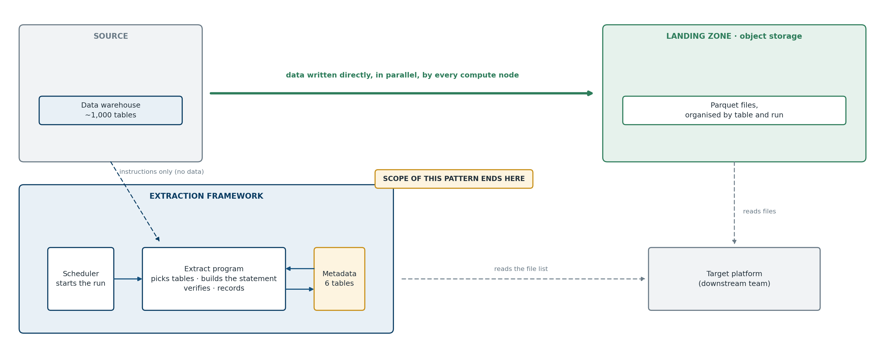
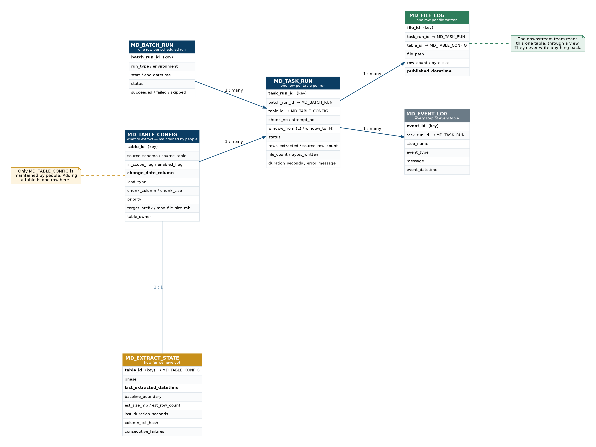

# Getting a Data Warehouse Out in Files

**A metadata-driven pattern for large-scale extraction and migration.**

By Pavan Kumar Tummala

Sooner or later most data warehouses have to be copied somewhere else — a platform
migration, a cloud change, a merger, an archive obligation. The requirement usually
arrives sounding trivial (*"we just need the data out"*) and is anything but.

This is a 34-page white paper describing a design that survives contact with the
real version of that problem: around a thousand tables, tens of terabytes, a
ten-hour nightly window, and a target platform on the other side of a network
boundary.

Amazon Redshift and Microsoft Fabric are used as worked examples. Almost none of
the reasoning depends on that choice — Appendix D covers Snowflake, BigQuery and
Synapse, all verified against vendor documentation.

---

## The four ideas worth taking away

**Push the export down into the engine.** Reading a warehouse over JDBC funnels
every row through one coordinating node. Every serious warehouse has a bulk export
command that writes from all compute nodes straight to object storage.

**That command is maybe 5% of the work.** It writes files fast. It will not tell you
whether they were the right ones. Knowing what changed, proving the copy worked,
recovering at 3am — that is the actual project, and it is where the estimate belongs.

**Take the boundary from the data, not the clock.** Measure the highest change-date,
extract up to it, and move the marker only once the files are confirmed. A marker
that cannot step over data it was never shown is most of correctness in one sentence.

**Say the uncomfortable thing early.** At 50 TB the first full load is several nights,
not one. That conversation is much cheaper before a plan is committed than after.

---

## Architecture



Data travels directly from the warehouse to object storage. The program sits to one
side, issuing instructions and reading back results — no rows pass through it. That
split is what lets a small framework move very large volumes.

---

## The control layer is six tables



Only `MD_TABLE_CONFIG` is maintained by people. Adding a table to the process means
inserting one row — no code change, no release, no deployment.

---

## What's in here

| Path | Contents |
|---|---|
| `docs/…whitepaper.pdf` | The paper, formatted. 34 pages, bookmarked |
| `docs/…whitepaper.md` | Same content in Markdown, renders on GitHub |
| `docs/…whitepaper.docx` | Word version, imports cleanly into Confluence |
| `images/` | The ten diagrams, PNG |
| `sql/` | The metadata schema, runnable |
| `LICENSE` | MIT |

---

## Quick start — stand up the control schema

```sh
psql -f sql/01-metadata-schema.sql     # six tables, constraints, indexes
psql -f sql/02-downstream-view.sql     # the read-only consumer interface
psql -f sql/03-example-config.sql      # optional: six worked table archetypes
```

`sql/04-operational-queries.sql` is the one to open first. It holds the baseline
progress report, the failure query, the volume-anomaly check, the "where exactly did
this table stop" query, and — most importantly — the profiling query described below.

All four files have been executed against PostgreSQL 16. They run clean, in order.

---

## The single most valuable thing to measure first

Before committing to any plan, test whether each table's change-date column actually
**advances between commits**. A large load often commits several times; if it stamps
every row with one timestamp captured at the start, rows can be missed permanently and
silently.

```sql
SELECT COUNT(*)                        AS rows_in_window,
       COUNT(DISTINCT last_updated_ts) AS distinct_timestamps,
       MIN(last_updated_ts), MAX(last_updated_ts)
FROM   sales.fct_orders
WHERE  last_updated_ts >= '<start of yesterday''s load>';
```

A handful of distinct values clustered at the load's start time means the timestamp is
frozen. Values spread across the load's duration means it advances properly.

This cannot be answered reliably by asking. Section 10.3.1 explains why it matters.

---

## A note on accuracy

Technical claims specific to Amazon Redshift were checked against AWS documentation
rather than written from memory. That check corrected several things, including:

- `CLEANPATH` and `ALLOWOVERWRITE` **cannot both be specified** — an earlier draft's
  example statement would not have run
- Parquet compression is **not selectable**: Snappy per row group, no file-level option
- `TIMESTAMPTZ` **loses its time zone** on export; only the timestamp value is written
- `MAXFILESIZE` is rounded down to a multiple of the 32 MB row-group target

Snowflake, BigQuery and Synapse commands in Appendix D were likewise verified.
Throughput figures in Section 9.1 are explicitly illustrative — measure your own.

---

## Licence

MIT — see [`LICENSE`](LICENSE). Use the schema, adapt the design, build on it.
Attribution appreciated but not required beyond the terms of the licence.

Copyright (c) 2026 Pavan Kumar Tummala
